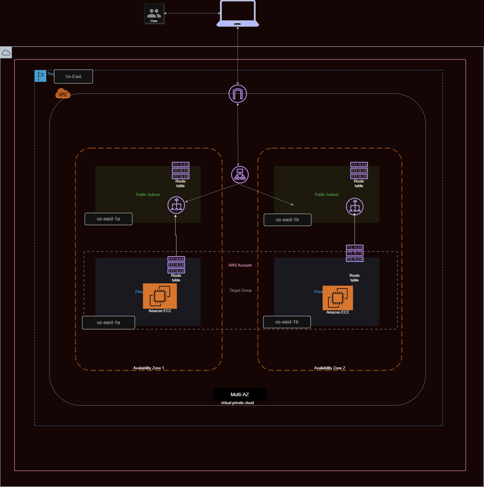

# Architectural Diagram




# Terraform AWS Web Server

This project provisions a simple web server on AWS using Terraform.
The server hosts a static HTML page displaying my full name.

## Architecture
- AWS EC2 (Ubuntu 22.04 LTS AMI)
- Nginx web server
- Security Group allowing HTTP (port 80)

## Prerequisites
- Terraform >= 1.3
- AWS CLI configured

## How to Run
- Configure an aws IAM profile with the name "ruth-dev"
```
aws configure --profile ruth-dev
```
follow the prompt, providing your Aws non-root IAM access_key, Secret_access_Key and region as us-east-1

```bash
cd remote_backend
terraform init
terraform apply --auto-approve

cd ../infra_instance
terraform init
terraform plan
terraform apply --auto-approve
```

##  Note

After terraform apply is successful, it output the load_balancer_dns which you can use to access the webserver